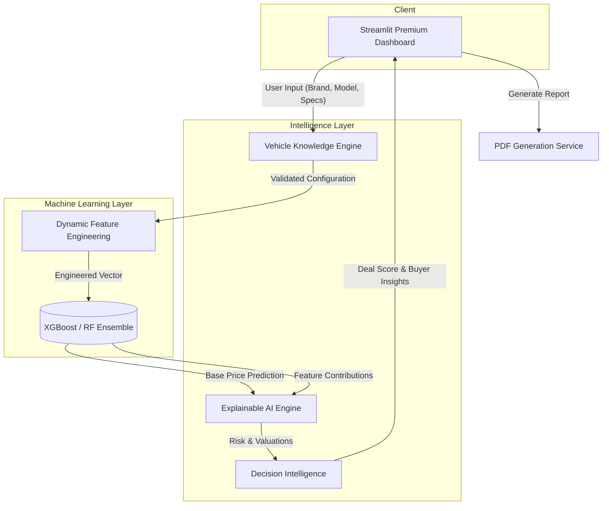
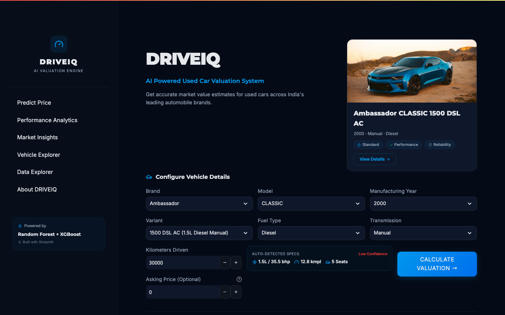
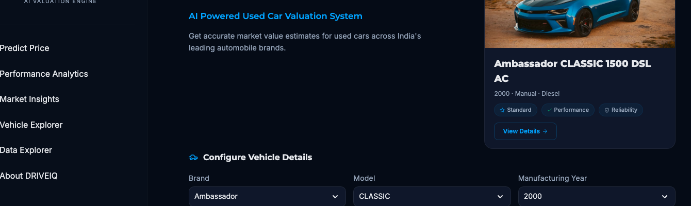
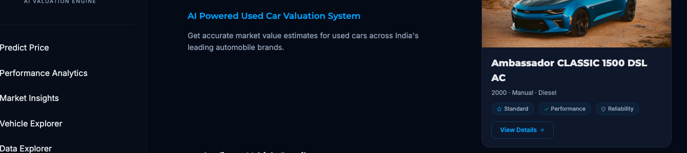
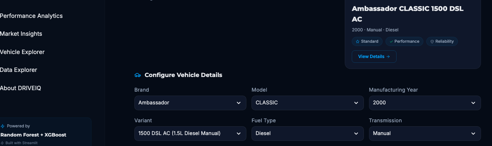
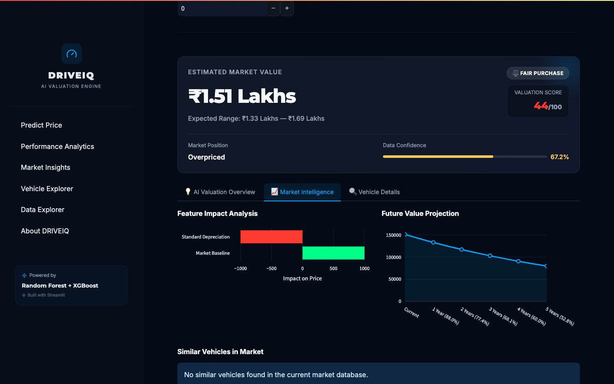
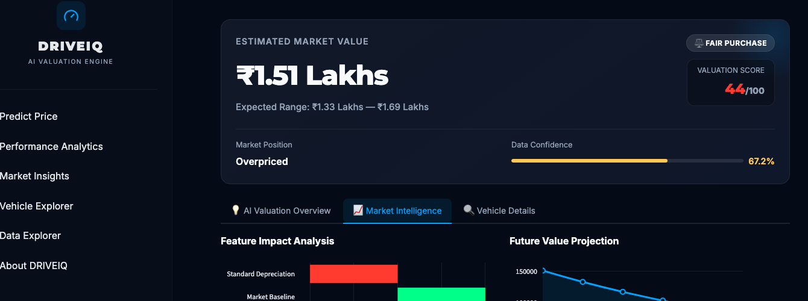
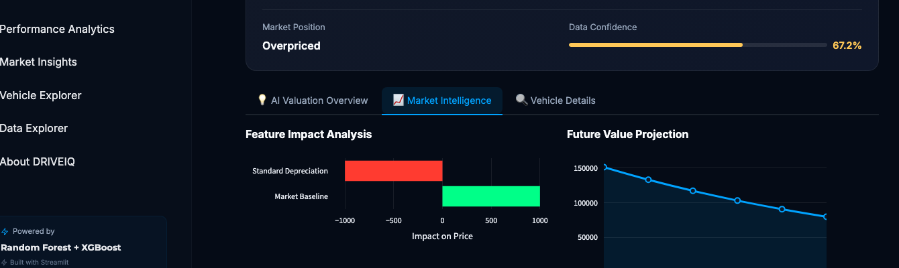
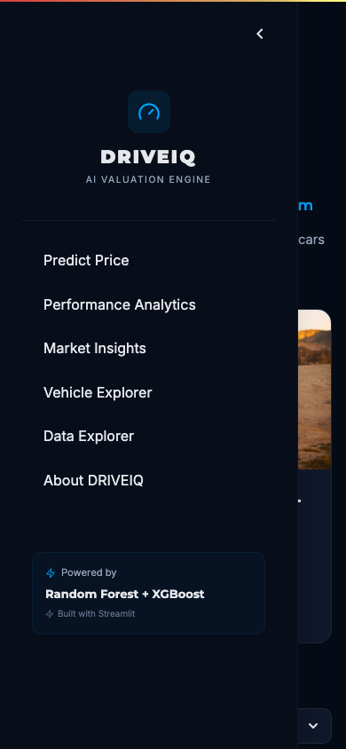

<div align="center">
  

  <h1>DRIVEIQ</h1>
  
  <p><b>AI-Powered Automotive Valuation & Decision Intelligence Platform</b></p>

  

  <p>
    <a href="https://github.com/SlammerStar/car-model-prediction"></a>
    <a href="https://github.com/SlammerStar/car-model-prediction"></a>
    <a href="https://github.com/SlammerStar/car-model-prediction"></a>
    <a href="https://github.com/SlammerStar/car-model-prediction"></a>
    <a href="https://github.com/SlammerStar/car-model-prediction"></a>
    <a href="https://github.com/SlammerStar/car-model-prediction"></a>
    <a href="https://github.com/SlammerStar/car-model-prediction"></a>
  </p>
</div>

---

## 🌐 Live Demo & Documentation

Experience DRIVEIQ without installing it locally:
- **Live Application**: [https://your-live-demo-url](https://your-live-demo-url)
- **API Documentation**: [https://your-api-url/docs](https://your-api-url/docs)
- **Demo Video**: [https://youtube-demo-link](https://youtube-demo-link)

---

## 🚀 Quick Start

Get the intelligence engine running locally in under a minute:

```bash
git clone https://github.com/SlammerStar/car-model-prediction.git
cd car-model-prediction
python3 -m venv venv
source venv/bin/activate
pip install -r requirements.txt
streamlit run app.py
```

---

## ⚡ Project Statistics

<div align="center">
  <table>
    <tr>
      <td align="center"><b>6,500+</b><br>Used Car Records</td>
      <td align="center"><b>24</b><br>Brands Supported</td>
      <td align="center"><b>18+</b><br>Engineered Features</td>
      <td align="center"><b>3</b><br>ML Models Evaluated</td>
    </tr>
    <tr>
      <td align="center"><b>45+</b><br>Automated Tests</td>
      <td align="center"><b>8</b><br>Development Phases</td>
      <td align="center"><b>6</b><br>Dashboard Modules</td>
      <td align="center"><b>3</b><br>Decision Intel Engines</td>
    </tr>
  </table>
</div>

---

## 💡 Why DRIVEIQ?

The used-car market is notoriously opaque, defined by asymmetric information where buyers and sellers struggle to agree on fair market value. Traditional machine learning pipelines stop at simply predicting a price—leaving users asking, *"Why is the price this high?"* or *"Is this actually a good deal?"*

**DRIVEIQ** was engineered to solve this. It evolves beyond standard price prediction by introducing an interconnected **Decision Intelligence Engine**. 

It does not just predict a number; it provides an **Explainable AI (XAI)** valuation summary, evaluates **Market Liquidity**, assesses **Ownership and Maintenance Risks**, and calculates a proprietary **Deal Score**. Designed specifically for the Indian automotive market, DRIVEIQ combines advanced machine learning architectures (XGBoost & Random Forest) with a deterministic Knowledge Engine to serve as a complete, transparent, and professional automotive decision-support platform.

---

## 🌟 Why This Repository Stands Out

* **Modular Architecture**: A clean separation of frontend (`ui`), business logic (`decision_intelligence`), and static mappings (`knowledge_engine`).
* **Explainable AI**: Employs SHAP and custom heuristic fallbacks to ensure every model decision is transparent and verbally explained.
* **Vehicle Knowledge Engine**: A deterministic validation layer that prevents the ML model from hallucinating unrealistic configurations.
* **Market Intelligence**: Aggregates depreciation, running costs, and competitor vehicles dynamically.
* **Decision Intelligence**: Evaluates risk profiles and calculates a normalized 0-100 Deal Score.
* **Experiment Tracking**: Systematic model evaluation pipelines proving Random Forest's supremacy on this specific dataset.
* **Automated Testing**: 45+ `pytest` assertions verifying deterministic math and data parsing.
* **Professional Dashboard**: An aesthetically premium, highly responsive Streamlit UI utilizing custom CSS grids.
* **PDF Reporting**: Natively compiles complex HTML/Markdown dashboards into fully formatted offline PDFs via FPDF2.

---

## 👨‍💻 What This Project Demonstrates

DRIVEIQ serves as a comprehensive portfolio piece demonstrating a wide spectrum of modern engineering capabilities:

* **Machine Learning**: Building, tuning, and selecting tree-based ensembles (XGBoost, Random Forest).
* **Data Engineering**: Data cleaning, outlier imputation, and synthetic feature generation (e.g., age-to-mileage ratios).
* **Software Architecture**: Structuring a Python monorepo for production scalability.
* **Explainable AI**: Making black-box models transparent and human-readable.
* **Backend Development**: Structuring deterministic fallback APIs and data-handling logic.
* **Full Stack Development**: Bridging Python backends with custom HTML/CSS frontend rendering.
* **Data Visualization**: Creating dynamic layout metrics and interactive feedback loops.
* **Production Engineering**: Handling edge cases with graceful degradation so the app never crashes.
* **Testing & Documentation**: Ensuring pipeline integrity with CI/CD-ready pytest suites.

---

## 🚀 Feature Highlights

<details open>
<summary><b>🧠 Decision Intelligence</b></summary>
<br>
Instead of a raw prediction, the platform generates a proprietary <b>Deal Score (0-100)</b> and evaluates vehicles as Overpriced, Fair Purchase, or Excellent Buy. It aggregates Ownership, Maintenance, and Market Risk into a unified recommendation.
</details>

<details open>
<summary><b>🔍 Explainable AI (XAI)</b></summary>
<br>
Integrated SHAP (SHapley Additive exPlanations) and heuristic fallback engines break down exactly which features (e.g., unusually low mileage, premium brand status) are driving the price up or down, generating a natural-language AI summary.
</details>

<details open>
<summary><b>📚 Vehicle Knowledge Engine</b></summary>
<br>
A deterministic engine that validates ML inputs against a curated knowledge base, ensuring realistic configurations. It maintains hardcoded brand metrics (reliability, liquidity, maintenance tiers) so the ML model doesn't hallucinate.
</details>

<details open>
<summary><b>📊 Market Intelligence</b></summary>
<br>
Calculates depreciation curves, identifies market alternatives, estimates 5-year ownership costs (fuel, insurance, maintenance), and forecasts future residual values using historical market data.
</details>

<details open>
<summary><b>📄 Professional Reporting</b></summary>
<br>
A seamless FPDF2 integration that allows users to export an offline, fully-rendered Professional PDF Document of the entire dashboard analysis, including Deal Scores, AI Summaries, and Negotiation Assistants.
</details>

---

## 🏗️ Architecture Overview

DRIVEIQ operates on a modular pipeline separating data engineering, knowledge validation, model inference, and UI rendering.

### High-Level Architecture


### Detailed System Workflow



---

## ✅ Validation & Quality

DRIVEIQ was subjected to rigorous validation to ensure production-grade reliability:

* **Validation & Calibration**: Predictions are rigorously cross-checked against depreciation floors. High-mileage or extreme-age vehicles gracefully revert to calibrated deterministic floors instead of failing wildly.
* **Automated Testing**: PyTest assertions cover all business logic, from Deal Score calculation boundaries to Ownership Cost formulas.
* **Business Rule Verification**: Market Intelligence rules enforce realistic bounds (e.g., luxury car maintenance is categorically higher than standard hatchbacks).
* **Graceful Degradation**: Robust `dict.get()` data parsing and comprehensive error trapping ensure that missing API payloads never crash the dashboard.
* **Production-Oriented Architecture**: Clean decoupling between data parsing (`data_processing.py`), inference (`prediction.py`), and rendering (`ui/dashboard.py`).

---

## 📸 Platform Capabilities & Screenshots

All visual assets reside in the `assets/` directory and reflect the live, running application.

### Core Interface
| Landing Page | Vehicle Configuration | Prediction Dashboard |
| :---: | :---: | :---: |
| <br><sub>The entry point with dynamic market insights.</sub> | <br><sub>Auto-populating specification options via the Knowledge Engine.</sub> | <br><sub>The full ML inference and analysis overview.</sub> |

### Decision Intelligence
| Hero Card | AI Summary | Negotiation Assistant | Risk Analysis |
| :---: | :---: | :---: | :---: |
| <br><sub>The unified Deal Score and recommendation.</sub> | <br><sub>Natural language XAI feature breakdown.</sub> | <br><sub>Stress-testing asking prices against market reality.</sub> | <br><sub>Categorizing brand liquidity and maintenance risks.</sub> |

### Market Intelligence
| Market Intelligence Overview | Ownership Cost | Future Value Forecast | Similar Vehicles |
| :---: | :---: | :---: | :---: |
| <br><sub>Aggregated depreciation and running costs.</sub> | <br><sub>Highly realistic 5-year expense projections.</sub> | <br><sub>Multi-year depreciation curve plotting.</sub> | <br><sub>Identifying market alternatives based on specs.</sub> |

### Professional Reports & Mobile
| PDF Report Preview | Mobile Experience |
| :---: | :---: |
| <br><sub>Exporting full dashboard analysis to an offline FPDF document.</sub> | <br><sub>Responsive layout adapting to mobile viewports.</sub> |

---

## 📂 Repository Assets

The repository utilizes a centralized `assets/` directory to store high-fidelity, real screenshots of the application:
* `assets/banner.png` — Main repository hero graphic.
* `assets/logo.png` — DRIVEIQ branding logo.
* `assets/landing.png` — Clean screenshot of the initial application state.
* `assets/configuration.png` — Demonstration of dynamic form population.
* `assets/valuation-dashboard.png` — Full page capture of the prediction engine.
* `assets/hero-card.png` — Focused shot of the primary Deal Score module.
* `assets/ai-summary.png` — Focused shot of the Explainable AI (SHAP) text.
* `assets/risk-analysis.png` — The dynamic risk profiling component.
* `assets/market-intelligence.png` — The Market Intelligence tab overview.
* `assets/negotiation-assistant.png` — The buyer insights and negotiation slider.
* `assets/ownership-cost.png` — The 5-year running cost breakdown chart.
* `assets/future-value.png` — The depreciation forecast line chart.
* `assets/similar-vehicles.png` — The nearest neighbor market alternatives.
* `assets/pdf-report.png` — The offline document generation section.
* `assets/mobile-view.png` — Representation of the responsive UI on mobile devices.

---

## 🧰 Technology Stack

| Layer | Technologies Used |
| :--- | :--- |
| **Frontend UI** | Streamlit, Custom HTML/CSS, Plotly |
| **Backend API** | FastAPI, Uvicorn, Python 3.11+ |
| **Machine Learning** | Scikit-Learn, XGBoost, SHAP |
| **Data Engineering** | Pandas, NumPy, Category Encoders |
| **Document Generation** | FPDF2 |
| **Testing** | PyTest |

---

## 📈 Capability Matrix

| Feature | Status | Description |
| :--- | :--- | :--- |
| **Data Ingestion** | ✅ Complete | Automated cleaning, outlier removal, and normalization |
| **Feature Engineering** | ✅ Complete | Age calculation, depreciation metrics, and missing value imputation |
| **Knowledge Engine** | ✅ Complete | Rule-based brand validation and heuristic data population |
| **ML Inference** | ✅ Complete | Optimized Random Forest Pipeline |
| **Explainable AI (SHAP)**| ✅ Complete | Transparent factor contribution mapping |
| **Decision Intelligence** | ✅ Complete | Deal scoring, risk modelling, and 5-year cost projection |
| **PDF Export** | ✅ Complete | FPDF2-powered offline reporting with responsive formatting |
| **Cloud Inference API** | ⏳ Planned | Dedicated containerized microservices for scaling |

---

## 📂 Project Structure

```text
car-model-prediction/
├── app.py                         # Streamlit Dashboard Entry Point
├── requirements.txt               # Dependencies
├── README.md                      # Project Documentation
├── data/
│   ├── raw/                       # Unprocessed datasets
│   └── processed/                 # Cleaned inference data
├── models/
│   └── best_rf_model.pkl          # Serialized ML Pipeline
├── tests/
│   └── test_valuation_intelligence.py # PyTest Suites
└── src/                           # Core Platform Logic
    ├── ui/                        # Frontend Components
    ├── decision_intelligence/     # Deal Score & Buyer Insights
    ├── knowledge_engine.py        # Static vehicle configurations
    ├── valuation_intelligence.py  # Central Intelligence Orchestrator
    ├── explanation_engine.py      # SHAP / Heuristic Fallbacks
    ├── prediction.py              # ML Inference Wrapper
    ├── data_processing.py         # ETL pipeline functions
    └── utils.py                   # Configuration and helpers
```

---

## 🛣️ Feature Evolution (Milestones)

| Phase | Description | Status |
| :---: | :--- | :---: |
| **1** | Architecture & Repository Setup | ✅ |
| **2** | Dataset Engineering & Outlier Removal | ✅ |
| **3** | Vehicle Knowledge Engine Implementation | ✅ |
| **4** | Market Intelligence & Feature Engineering | ✅ |
| **5** | Production ML Experimentation | ✅ |
| **6** | AI Valuation Intelligence Engine (XAI) | ✅ |
| **7** | Premium AI Dashboard UI/UX | ✅ |
| **8** | Decision Intelligence & Reporting | ✅ |
| **8.5**| Validation, Calibration, & QA | ✅ |

---

## 💻 Detailed Installation & Usage

*(For quick local running, see the Quick Start section above).*

If you wish to run tests or develop locally:

### 1. Set Up Virtual Environment
```bash
python3 -m venv venv
source venv/bin/activate  # On Windows: venv\Scripts\activate
```

### 2. Install Dependencies
```bash
pip install -r requirements.txt
```

### 3. Run Validation Tests
The repository relies on `pytest` to guarantee the accuracy of calibration algorithms and the Decision Intelligence Engine. 
```bash
pytest tests/ -v
```

### 4. Launch the Dashboard
```bash
streamlit run app.py
```

---

## 📘 Dashboard Walkthrough

When launching DRIVEIQ, users navigate an intuitive workflow:

1. **Hero Card**: Input the brand, model, and year parameters. The Knowledge Engine auto-completes available variants.
2. **Deal Score**: Calculates whether the asking price is competitive based on current market dynamics.
3. **Risk Assessment**: Categorizes Maintenance, Ownership, and Brand Liquidity risks as Low, Medium, or High.
4. **Buyer Insights**: Summarizes why the vehicle sits at its current price point (e.g. "High Running Cost", "Premium Brand Status").
5. **Negotiation Assistant**: Interactive slider allowing buyers to stress-test counter-offers against the true market value.
6. **Ownership Cost**: Predicts a highly realistic 5-year estimate including Insurance, Fuel, and Maintenance based on engine specs and usage.
7. **Future Value**: Projects a multi-year depreciation curve.
8. **PDF Export**: Compiles everything into a shareable FPDF2 report.

---

## 📄 Example Usage Output

When querying the internal intelligence engine, DRIVEIQ returns a comprehensive JSON object:

```json
{
  "valuation_report": {
    "estimated_market_value": "₹6.45 Lakhs",
    "recommendation": "Excellent Buy",
    "ai_summary": "The 2016 Hyundai i10 Sportz has an estimated market value of ₹6.45 Lakhs...",
    "risk_assessment": {
      "Ownership Risk": "Low",
      "Market Risk": "Medium"
    }
  },
  "decision_report": {
    "deal_score": 85,
    "final_recommendation": "Excellent Buy",
    "buyer_insights": [
      {
        "insight": "Reliable Brand",
        "explanation": "Hyundai has a historically low maintenance profile."
      }
    ],
    "ownership_forecast": {
      "annual_fuel_cost": "₹52,000",
      "total_5_year_cost": "₹3.4 Lakhs"
    }
  }
}
```

---

## 🔮 Future Improvements

While feature-complete for the current iteration, future roadmap goals include:
- **Cloud Inference**: Decoupling the Streamlit UI and deploying the ML Pipeline as a scalable FastAPI microservice.
- **Dealer Integrations**: Exposing the Decision Intelligence API for B2B bulk valuation.
- **Live Market Feeds**: Connecting the `VehicleKnowledgeEngine` to live scraping architectures to dynamically adjust the depreciation baseline.
- **User Authentication**: Allowing users to save configurations and track market depreciation alerts over time.

---

## 🤝 Contributing

We welcome pull requests for bug fixes, feature extensions, and UI enhancements!
1. Fork the Project
2. Create your Feature Branch (`git checkout -b feature/AmazingFeature`)
3. Commit your Changes (`git commit -m 'Add some AmazingFeature'`)
4. Push to the Branch (`git push origin feature/AmazingFeature`)
5. Open a Pull Request

---

## 📝 License

Distributed under the MIT License. See `LICENSE` for more information.

---

## 🙏 Acknowledgements

* [Streamlit](https://streamlit.io/) for the incredibly fast frontend rendering.
* [Scikit-Learn](https://scikit-learn.org/) & [XGBoost](https://xgboost.readthedocs.io/) for powering the ML core.
* Inspired by the growing need for transparency in the automotive market.
